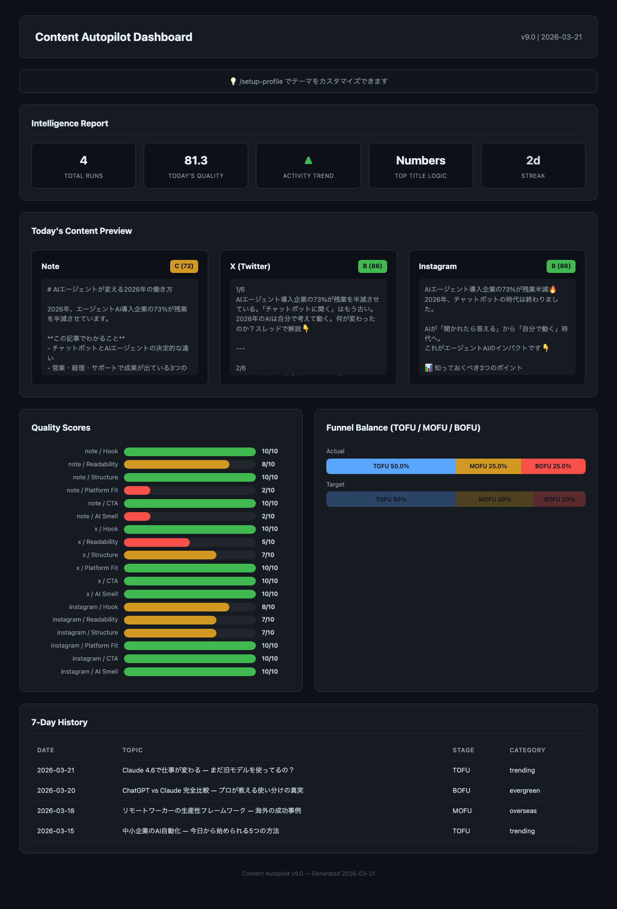

<h1 align="center">Content Autopilot</h1>

<p align="center">
<strong>コンテンツ制作に毎日3時間かけていませんか？<br>
1コマンドで、note・X・Instagramを同時に自律生成します。</strong>
</p>

---

## 問題

AIにコンテンツを書かせても、結局こうなります:

- 「AIに何を書かせるか」を**人間が毎回考える**
- 出力が「本記事では〜」「さまざまな方法が〜」で**AI臭くてそのまま使えない**
- note・X・Instagramの書き分けを**プラットフォームごとに手動で依頼**
- 品質チェックは**目視で属人的**。基準がブレる
- 前回何を書いたか覚えていないから**ファネル設計が崩れる**

## 解決

`/daily-autopilot` の1コマンドで全て自律的に実行。トピック選定、3プラットフォーム同時生成、6軸品質採点、AI臭除去、履歴管理まで人間の介入ゼロ。


```
━━━━ Content Autopilot ━━━━━━━━━━━━━━━━━━
[1/8] Profile → 初回は自動作成（セットアップ不要）
[2/8] Funnel分析 → MOFU不足を検出 → MOFU記事に決定
[3/8] WebSearch → トピック自動選択
[4/8] note(2,500字) + X(6tweets) + IG → 同時生成
[5/8] 6軸品質採点 → 94/100 ✓
[6/8] 公開前チェック → 8/8 通過 ✓
[7/8] Dashboard → ブラウザ自動表示
[8/8] note.com投稿画面 + X投稿画面 → 自動起動
━━━━━━━━━━━━━━━━━━━━━━━━━━━━━━━━━━━━━━━━━━
```

品質が低い場合は**自動で改善** — 人間に修正を求めません:
```
note: 68/100 → 密度不足 + AI臭を自動検出 → 修正
note: 82/100 ✓ (自動改善 +14点)
```

## 証拠

### 品質: Claude直接 vs Content Autopilot

```
Claude直接:       56/100 (D) — AI臭5パターン、467文字
  → "本記事では、AIを活用した業務効率化について解説します。"

Content Autopilot: 94/100 (A) — AI臭ゼロ、2,841文字
  → "「AIを使ってるのに、なぜ効率が上がらないのか？」"
```

`python3 run_pipeline.py --compare` で実際に確認できます。

`/setup-profile` でテーマを変えると、検索・トピック選定・コンテンツが全て連動して変わります（AI、英語学習、料理、投資、何でも対応）。

### 生成されるnote記事

```markdown
# 3つのAI活用法で業務時間を半分にした話

「AIを使ってるのに、なぜ効率が上がらないのか？」

**この記事でわかること**
- チャットボットとAIエージェントの決定的な違い
- 実際に業務時間を50%削減した3つの方法
- 明日から始められる導入ステップ
```

### ダッシュボード（[ライブデモ](https://fp-sudo.github.io/content-autopilot/)）



### 外部連携

パイプライン完了後、コンテンツを各プラットフォームに自動で届けます:

| 連携先 | 何が起きるか | なぜ必要か |
|-------|------------|----------|
| **note.com** | エディタが開き、記事がクリップボードに | 貼り付けて「投稿」を押すだけ |
| **X** | 1ツイート目がプリセットされた投稿画面を表示 | アルゴリズム最適化済みスレッド原稿を提供 |
| **Gemini** | OGP画像（16:9）を自動生成 | noteに画像なしで投稿する人はいない |
| **Google Analytics** | 過去のPVデータを取得 | 「何が読まれたか」で次のトピックを決める |
| **Notion** | 記事をNotionページに保存 | チームでレビュー共有する場合に |
| **Gmail** | 記事をHTML下書きに保存 | メルマガ・ニュースレター用途に |
| **Calendar** | 翌日の投稿リマインダーを登録 | 投稿忘れを防止 |

note.comとXは**MCP不要**（誰の環境でも動作）。他はMCPサーバー設定時のみ自動連携。

---

## 試す

**本番（Claude Codeで自律実行）:**
```bash
/plugin marketplace add FP-sudo/content-autopilot
/plugin install content-autopilot@content-autopilot
/daily-autopilot    # Claudeが自律的にWebSearch→コンテンツ生成→品質採点→改善を実行
```

**デモ（ターミナルで動作確認）:**
```bash
# Claude Code不要 — サンプルデータでパイプライン全体の動作を確認
git clone https://github.com/FP-sudo/content-autopilot.git && cd content-autopilot/plugins/content-autopilot/scripts && python3 run_pipeline.py
python3 run_pipeline.py --compare    # 品質比較デモ
python3 test_scripts.py              # 23テスト確認
```

---

## Claudeに直接頼むのと何が違うか

Claudeは優秀なライターですが、**セッションを跨いだ記憶と定量的な品質管理**はできません:

| Claudeにできないこと | Content Autopilotの実装 |
|---|---|
| 過去の履歴を覚える | `content-history.json` にセッション跨ぎで蓄積 |
| ファネルバランスを計算する | TOFU/MOFU/BOFU比率を自動計算・自動調整 |
| 毎回同じ基準で採点する | 6軸・10パターンで定量採点 |
| ダッシュボードを生成する | HTMLで品質・ファネル・履歴を可視化 |

---

## 品質採点（6軸）

| 軸 | チェック内容 | 例 |
|---|---|---|
| フック | 冒頭で読者を掴めるか | 40文字以内の疑問・数字 |
| 可読性 | 段落長、文体一貫性 | 漢字率20-40% |
| 構造 | 見出し・まとめ | 3-7個の##見出し |
| 適合性 | プラットフォーム要件 | note: 2000字以上 |
| CTA | 行動喚起 | フォロー誘導 |
| AI臭 | AI特有パターン検出 | 10パターン自動除去 |

## コマンド

| コマンド | 機能 |
|---------|------|
| `/daily-autopilot` | 全自律パイプライン |
| `/setup-profile` | テーマ・文体カスタマイズ |
| `/trend-scout` | トレンドリサーチ |
| `/publish` | Notion/Gmail/Zapierに連携 |
| `/schedule` | カレンダーにリマインダー登録 |
| `/content-analytics` | コンテンツ分析 |
| `/log-performance` | PV・いいね数→学習 |
| `/cron-setup` | 毎日自動実行をcron設定 |

## 技術構成

```
plugins/content-autopilot/
├── skills/      129 SKILL.md
├── scripts/     12 Python scripts (4,000+ LOC)
├── commands/    9 slash commands
└── tests        23/23 pass
```

## License

MIT
